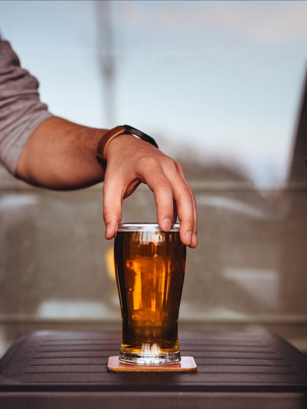
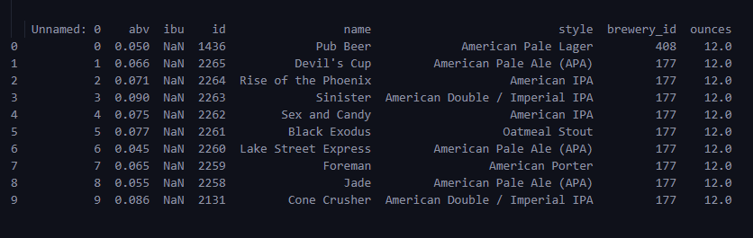
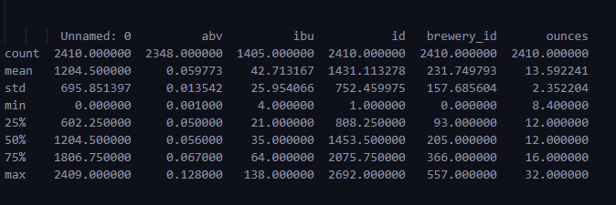
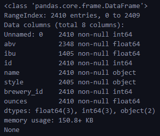
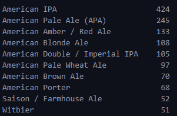
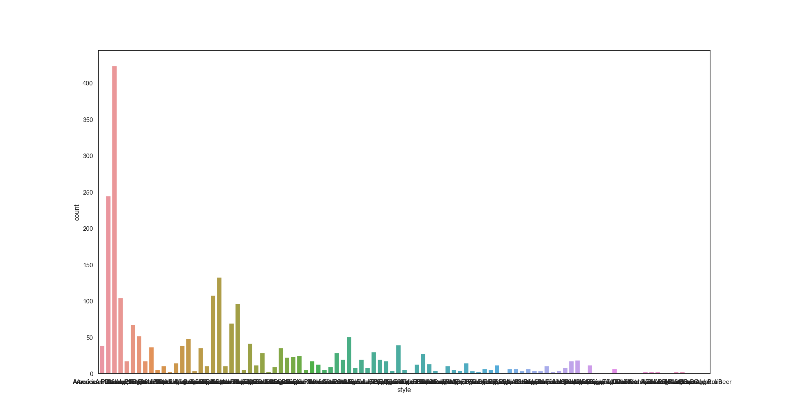
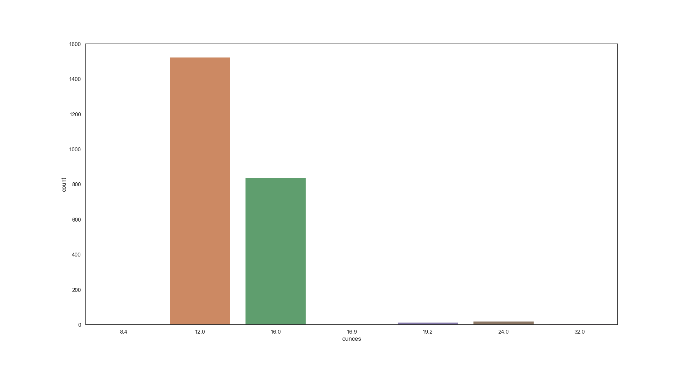
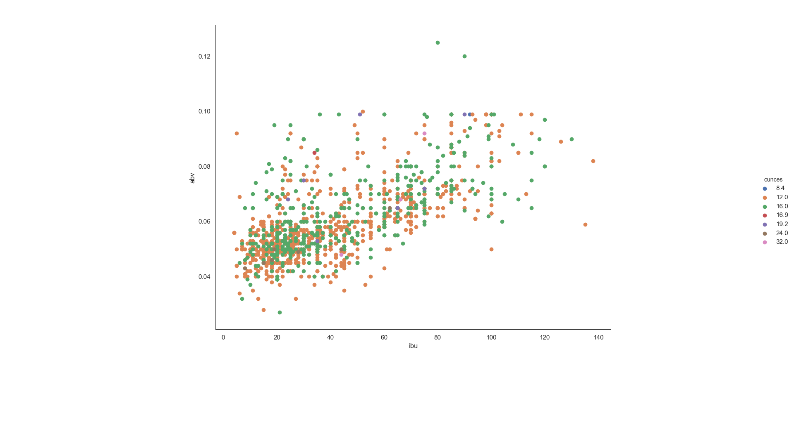
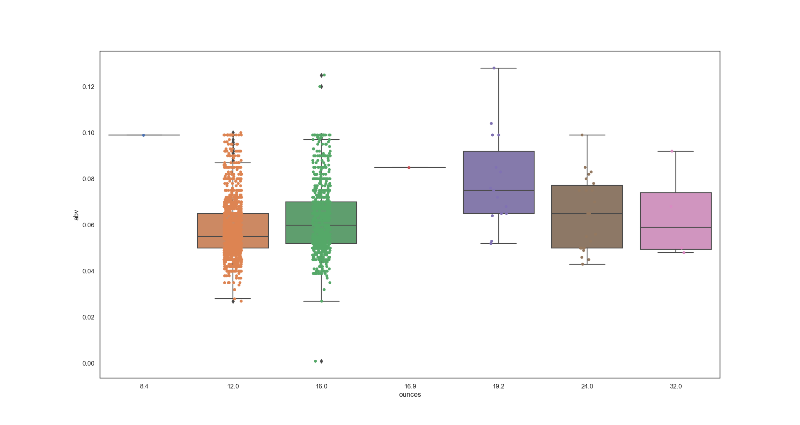
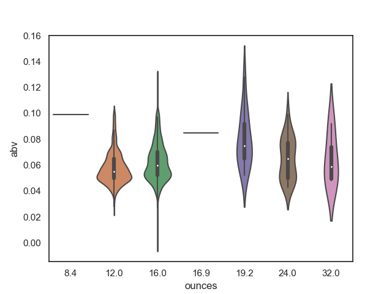

# Financial Applications of Machine Learning

## Assignment 1 - Data Visualization



For this assignment, I have used the craft beer dataset from [Kaggle](http://kaggle.com).

Beer Dataset - [Craft Beers Dataset](https://www.kaggle.com/nickhould/craft-cans)

### Step 1: Import Libraries

```python
import pandas as pd
import seaborn as sns
import matplotlib.pyplot as plt
sns.set(style="white", color_codes=True)
```

#### Configuring Pandas to show all columns of table

pd.set_option('display.max_rows', 500)
pd.set_option('display.max_columns', 500)
pd.set_option('display.width', 1000)

### Step 2: Load Dataset

```python
beers = pd.read_csv('./beers.csv')
print(beers.head())
```



### Step 3: Describing Data

`print(beers.describe())`



`print(beers.info())`



___

### Value Counts

#### Top 10 Types of Beer in the Dataset

`print((beers["style"].value_counts()).head(10))`



### Countplot

#### Styles of Beer

`sns.countplot(x='style', data=beers)`



#### Ounces of Beer

`sns.countplot(x="ounces", data=beers)`



### ScatterPlot

`sns.FacetGrid(beers, hue="ounces").map(plt.scatter, 'ibu', 'abv').add_legend()`



### BoxPlot

```python
ax = sns.boxplot(x="ounces", y="abv", data=beers)
ax = sns.stripplot(x="ounces", y="abv", data=beers, jitter=True, edgecolor="gray")
```



### Violin Plot

`sns.violinplot(x="ounces", y="abv", data=beers, size=6)`


